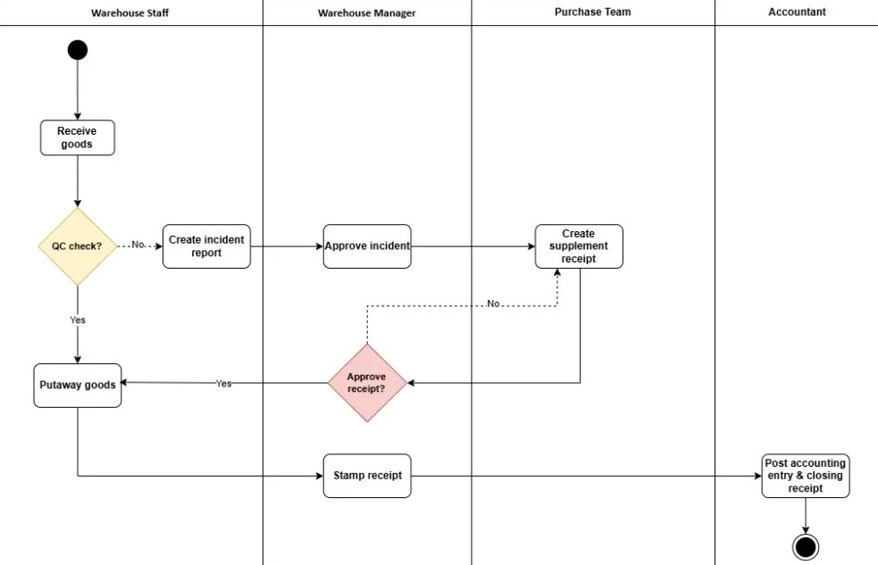
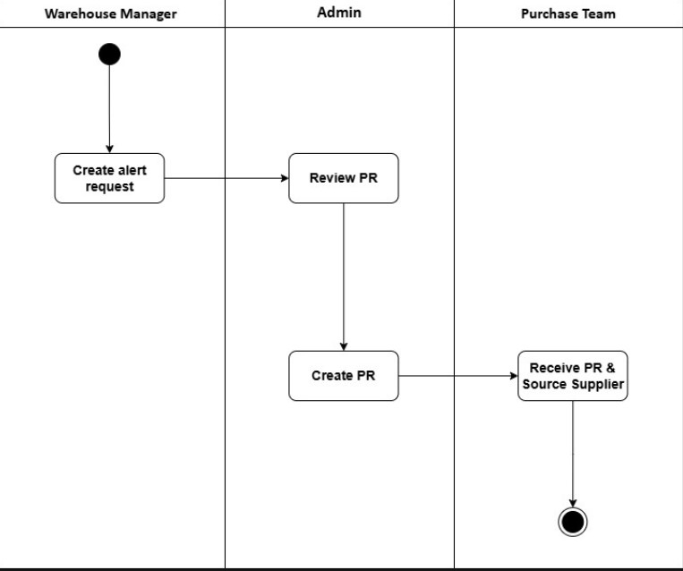
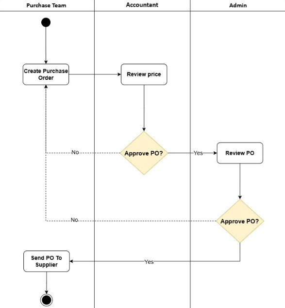

<h1 align="center">Hi, I'm Minh Thong</h1>

  <em>Backend Developer</em>

  
  
  
  

---

## About Me

Fresh graduate passionate about building **business-logic-heavy backend systems** — not just CRUD.

During my capstone project, I owned the full backend of an **Inbound Management module** for a real construction enterprise system. The experience taught me that the hardest part of backend development isn't writing code — it's correctly modelling complex business rules.

- Currently learning **Clean Architecture & DDD** by refactoring my capstone project
- Exploring **Docker, CI/CD** to understand how software actually runs in production
- Deepening knowledge in **JWT auth, role-based access control**
- Ask me about **procurement workflows, approval logic, or EF Core**

---

## Featured Project

### [`Construction Material Inventory and Project Cost Management System`](https://github.com/inLuvWithCalis/MatCost)

> Enterprise-grade inbound management system for a construction company.
> I owned the full backend of the **Inbound module** — from stock shortage alert to accounting closure.

**End-to-end workflow I implemented:**

    
  <b>Warehouse Goods Receiving Process</b>

    
  <b>Warehouse Purchase Request Process</b>

    
  <b>Warehouse Purchase Order Process</b>

**Key responsibilities:**
- Role-based PO creation, editing, submission and multi-level approval
- QC quality inspection recording and status management
- Incident reporting, approval flow, and resolution tracking
- Supplementary receipt generation on quantity/quality discrepancy
- Bin allocation and real-time inventory update on putaway
- Document signing, edit history, and full audit trail
- Cross-module notification system for status tracking
- Accounting verification and journal entry confirmation

**Tech stack:** `C# .NET` · `Entity Framework Core` · `SQL Server` · `REST API` · `React` · `Layered Architecture`

**What I learned:** Modelling multi-step approval workflows with role-based access, handling edge cases like partial delivery and discrepancy resolution, keeping business logic cleanly separated from infrastructure concerns.

---

## Tech Stack

**Primary (comfortable)**

**Also worked with**

**Tools & workflow**

---

## Currently Learning

| Topic | Why |
|---|---|
| Clean Architecture & DDD | Refactoring capstone to understand domain separation |
| Docker & containerization | Understanding how apps deploy in real environments |
| JWT + Role-based auth | Going deeper than what the capstone required |
| System design basics | Preparing for technical interviews |

---
